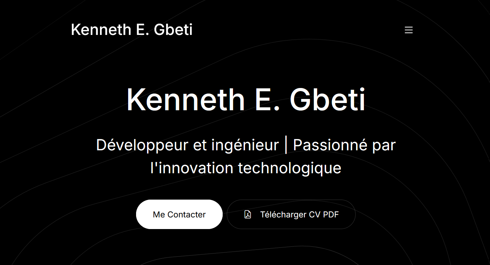

# 🚀 CV Web - Kenneth E. Gbeti

- 🐙 **Lien web CV** : [cv-kenneth-gbeti](https://kennethedwin147.github.io/cv_kenneth/)

> **Développeur et ingénieur | Passionné par l'innovation technologique**

Bienvenue sur mon CV web interactif ! Ce projet présente mon parcours professionnel, mes compétences techniques et mes projets de manière moderne et engageante.

## 🎯 Aperçu

Ce CV web a été conçu pour offrir une expérience utilisateur exceptionnelle tout en mettant en valeur mes compétences en développement web. Il combine design moderne, interactivité et contenu professionnel.

### 🌟 Fonctionnalités principales

- ✨ **Design responsive** - Parfaitement adapté à tous les appareils
- 🎬 **Vidéo intégrée** - Présentation de mon projet TCH098 (véhicule anti-gravité)
- 📱 **Navigation fluide** - Smooth scroll entre les sections
- 🎨 **Accordéons interactifs** - Exploration détaillée de mes compétences
- 📄 **Téléchargement PDF** - Version imprimable de mon CV
- 🔗 **Liens sociaux** - Accès direct à mes profils professionnels

## 🛠️ Technologies utilisées

- **HTML5** - Structure sémantique moderne
- **CSS3/Bootstrap 5** - Design responsive et composants UI
- **JavaScript** - Interactivité et animations
- **Bootstrap Icons** - Iconographie cohérente

## 📋 Sections du CV

### 🏠 **Accueil**
- Présentation personnelle avec vidéo de projet
- Boutons d'action (Contact & Téléchargement PDF)

### 💻 **Compétences** (Accordéons interactifs)
1. **Développement Back-end** - Java, JavaScript, PHP
2. **Bases de Données** - MySQL, PostgreSQL, SQL
3. **Outils & Méthodologies** - Git, APIs RESTful, Agile

### 👤 **À Propos**
- Résumé professionnel
- Points forts et qualités personnelles

### 🎓 **Formation & Éducation** (Onglets)
- Baccalauréat en génie électrique (ÉTS)
- AEC conception web (Maisonneuve)
- DEC sciences informatiques (Rosemont)
- Compétences linguistiques

### 🚀 **Projets**
- **TCH098** - Véhicule anti-gravité (ÉTS 2024)
- Vidéo YouTube intégrée
- Description détaillée du projet

Le CV s'adapte parfaitement à tous les écrans :
- 📱 **Mobile** (320px+) - Navigation optimisée
- 📱 **Tablette** (768px+) - Mise en page adaptée
- 💻 **Desktop** (1200px+) - Expérience complète

## 🔗 Liens utiles

- 📧 **Email** : [edwingbeti@gmail.com](mailto:edwingbeti@gmail.com)
- 📞 **Téléphone** : [438-725-1915](tel:438-725-1915)
- 💼 **LinkedIn** : [kenneth-gbeti](https://www.linkedin.com/in/kenneth-gbeti)
- 🐙 **GitHub** : [kenneth_edwin147](https://github.com/kenneth_edwin147)
- 🎥 **YouTube** : [@kennethgbet](https://youtube.com/@kennethgbet)

## 🚀 Comment utiliser

1. **Cloner ou télécharger** le projet
2. **Ouvrir** `cv-kenneth-gbeti.html` dans votre navigateur
3. **Explorer** les différentes sections
4. **Télécharger** la version PDF si nécessaire

## 🔧 Compétences Techniques Détaillées

### 💻 **Langages de Programmation**
- **Java** - Applications robustes et scalables
- **JavaScript** - Développement web côté serveur (Node.js)
- **PHP** - Développement web back-end avec Composer
- **C** - Programmation système et embarquée
- **C#** - Applications .NET et développement Windows
- **VHDL** - Description de circuits numériques et FPGA

### 🔌 **Électronique & IoT**
- **Microcontrôleurs** - Arduino, Raspberry Pi, ESP32/ESP8266
- **Internet des Objets (IoT)** - Solutions connectées et intelligentes
- **Systèmes Embarqués** - Développement de solutions électroniques
- **Capteurs & Actionneurs** - Intégration de composants électroniques
- **Protocoles IoT** - Communication sans fil (WiFi, Bluetooth)
- **Conception PCB** - Design de circuits imprimés

### 🗄️ **Bases de Données**
- **MySQL** - Gestion de bases de données relationnelles
- **PostgreSQL** - Système de gestion avancé
- **SQL** - Optimisation et conception de requêtes

### ⚙️ **Outils & Méthodologies**
- **Git & GitHub** - Contrôle de version collaboratif
- **APIs RESTful** - Conception et intégration
- **Agile & Scrum** - Méthodologies de développement
- **Microservices** - Architecture distribuée

---

*Merci de votre visite ! 🙏*

> *"L'innovation distingue un leader d'un suiveur."* - Steve Jobs
