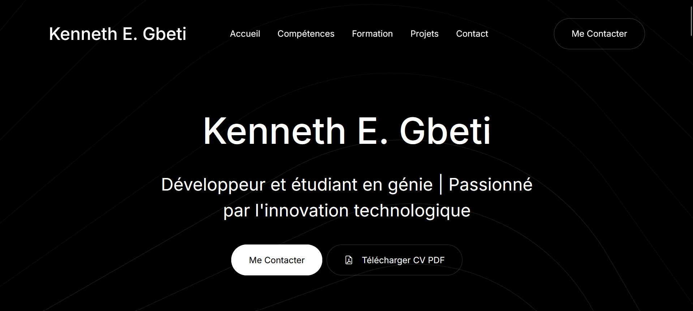

# 🚀 CV Web - Kenneth E. Gbeti

- 🐙 **Lien web CV** : [cv-kenneth-gbeti](https://github.com/kenneth_edwin147)



> **Développeur Web Back-end | Passionné par l'innovation technologique**

Bienvenue sur mon CV web interactif ! Ce projet présente mon parcours professionnel, mes compétences techniques et mes projets de manière moderne et engageante.

## 🎯 Aperçu

Ce CV web a été conçu pour offrir une expérience utilisateur exceptionnelle tout en mettant en valeur mes compétences en développement web. Il combine design moderne, interactivité et contenu professionnel.

### 🌟 Fonctionnalités principales

- ✨ **Design responsive** - Parfaitement adapté à tous les appareils
- 🎬 **Vidéo intégrée** - Présentation de mon projet TCH098 (véhicule anti-gravité)
- 📱 **Navigation fluide** - Smooth scroll entre les sections
- 🎨 **Accordéons interactifs** - Exploration détaillée de mes compétences
- 📄 **Téléchargement PDF** - Version imprimable de mon CV
- 🔗 **Liens sociaux** - Accès direct à mes profils professionnels

## 🛠️ Technologies utilisées

- **HTML5** - Structure sémantique moderne
- **CSS3/Bootstrap 5** - Design responsive et composants UI
- **JavaScript** - Interactivité et animations
- **Bootstrap Icons** - Iconographie cohérente

## 📋 Sections du CV

### 🏠 **Accueil**
- Présentation personnelle avec vidéo de projet
- Boutons d'action (Contact & Téléchargement PDF)

### 💻 **Compétences** (Accordéons interactifs)
1. **Développement Back-end** - Java, JavaScript, PHP
2. **Bases de Données** - MySQL, PostgreSQL, SQL
3. **Outils & Méthodologies** - Git, APIs RESTful, Agile

### 👤 **À Propos**
- Résumé professionnel
- Points forts et qualités personnelles

### 🎓 **Formation & Éducation** (Onglets)
- Baccalauréat en génie électrique (ÉTS)
- AEC conception web (Maisonneuve)
- DEC sciences informatiques (Rosemont)
- Compétences linguistiques

### 🚀 **Projets**
- **TCH098** - Véhicule anti-gravité (ÉTS 2024)
- Vidéo YouTube intégrée
- Description détaillée du projet

### 📞 **Contact**
- Informations complètes de contact
- Liens vers réseaux sociaux
- Formulaire de contact rapide

## 🎨 Design & UX

### Palette de couleurs
- **Primaire** : Bleu moderne et professionnel
- **Secondaire** : Gris élégant pour le texte
- **Accent** : Blanc pour les contrastes

### Typographie
- Police moderne et lisible
- Hiérarchie claire des titres
- Espacement optimisé pour la lecture

### Animations
- Effets de fade-in au scroll (AOS)
- Transitions fluides entre sections
- Accordéons avec animations d'ouverture

## 📱 Responsive Design

Le CV s'adapte parfaitement à tous les écrans :
- 📱 **Mobile** (320px+) - Navigation optimisée
- 📱 **Tablette** (768px+) - Mise en page adaptée
- 💻 **Desktop** (1200px+) - Expérience complète

## 🔗 Liens utiles

- 📧 **Email** : [edwingbeti@gmail.com](mailto:edwingbeti@gmail.com)
- 📞 **Téléphone** : [438-725-1915](tel:438-725-1915)
- 💼 **LinkedIn** : [kenneth-gbeti](https://www.linkedin.com/in/kenneth-gbeti)
- 🐙 **GitHub** : [kenneth_edwin147](https://github.com/kenneth_edwin147)
- 🎥 **YouTube** : [@kennethgbet](https://youtube.com/@kennethgbet)

## 🚀 Comment utiliser

1. **Cloner ou télécharger** le projet
2. **Ouvrir** `cv-kenneth-gbeti.html` dans votre navigateur
3. **Explorer** les différentes sections
4. **Télécharger** la version PDF si nécessaire

## 📁 Structure du projet

```
cv_web/
├── cv-kenneth-gbeti.html    # CV web principal
├── mon-cv.pdf              # Version PDF téléchargeable
├── assets/                 # Ressources (CSS, JS, images)
├── startup.html            # Template original
├── accordion.html          # Exemple d'accordéons
└── README.md              # Ce fichier
```

## 🎯 Objectifs du projet

Ce CV web démontre mes compétences en :
- **Développement front-end** - HTML, CSS, JavaScript
- **Design UX/UI** - Interface utilisateur moderne
- **Responsive design** - Adaptation multi-appareils
- **Intégration multimédia** - Vidéos et contenus riches

## 💡 Pourquoi ce CV ?

Dans un monde numérique, un CV web offre :
- **Différenciation** - Se démarquer des CV traditionnels
- **Interactivité** - Engagement accru des recruteurs
- **Accessibilité** - Disponible 24/7 en ligne
- **Démonstration** - Preuve concrète de mes compétences

## 🔄 Mises à jour

Ce CV est régulièrement mis à jour avec :
- Nouveaux projets et réalisations
- Compétences techniques acquises
- Améliorations du design et de l'UX
- Optimisations de performance

---

## 📞 Me contacter

Intéressé par mon profil ? N'hésitez pas à me contacter !

**Kenneth E. Gbeti**
Développeur Web Back-end
📍 Montréal, Québec, Canada
📧 edwingbeti@gmail.com
📱 438-725-1915

---

*Merci de votre visite ! 🙏*

> *"L'innovation distingue un leader d'un suiveur."* - Steve Jobs# cv_kenneth
